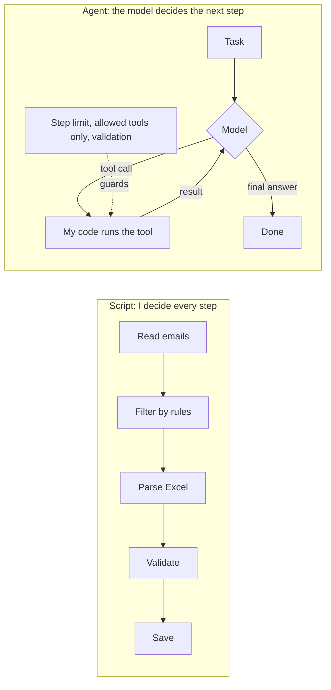

# email-excel-agent

An AI agent that reads a mailbox, picks sales-report emails, parses their Excel
attachments and saves validated rows to MySQL. Built in public in 30 days,
starting from zero Python (coming from PHP).

## Status

- [x] Week 1: Python basics, email filter on fake data, Excel column checker
- [x] Week 2: Claude API, JSON outputs, messy Excel cleaning, Pydantic validation, toy agent
- [ ] Week 3: IMAP + MySQL pipeline (no AI decisions)
- [ ] Week 4: the real agent, security, cron

## Script vs agent



The model never touches the mailbox or the database directly. It can only ask
my code to run a tool from a fixed list; my code checks the input, runs it,
validates the output and enforces a step limit.

## Project layout

| File | Purpose |
|---|---|
| `config.py` | Settings; secrets come from `.env` |
| `subject_parser.py` | Rule-based parsing of report subjects |
| `filters.py` | Email selection rules |
| `email_classifier.py` | Rules first, LLM for subjects the rules can't parse |
| `excel_checker.py` | Finds sheet and header row, checks columns |
| `excel_cleaner.py` | Converts messy cells to real dates and numbers |
| `models.py` | Pydantic models: what valid data looks like |
| `validator.py` | Splits rows into valid and invalid with reasons |
| `agent_toy.py` | Minimal tool-use agent loop |
| `make_test_files.py` | Generates 10 test Excel reports |

## Run

```bash
python -m venv .venv
source .venv/bin/activate          # Windows: .\.venv\Scripts\Activate.ps1
python -m pip install -r requirements.txt
cp .env.example .env               # Windows: copy .env.example .env, then add your API key
python make_test_files.py
python day12_validate.py
python agent_toy.py
```